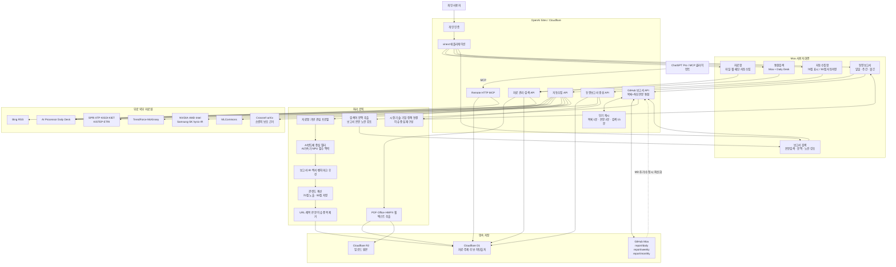

# Moa 아키텍처 구성도

Moa의 사용자 화면, API, 처리 로직, 저장소, 무료 외부 자료원과 GitHub 보고서 연동 구조를 나타낸다.

## 주요 흐름

1. 사용자는 Moa 웹 화면에서 자료를 저장·검색하거나 동향보고서를 열어본다.
2. ChatGPT 등 외부 AI 도구는 Remote HTTP MCP를 통해 Moa 자료와 Daily Desk를 검색한다.
3. 업로드 원본은 R2에 저장하고, 추출된 본문과 자료 메타데이터는 D1에 저장한다.
4. 자동수집은 무료 외부 자료원에서 후보를 찾고 AI반도체 관련성·품질·중복을 평가한다.
5. 동향보고서는 D1 자료와 외부 근거를 시장·기술·기업·정책 이슈로 재구성한다.
6. 완성된 일일·주간·월간 Markdown 보고서는 GitHub가 원본 저장소 역할을 한다.
7. 보고서 API는 GitHub 목록과 본문을 짧게 캐시해 최신성과 로딩 속도를 함께 관리한다.
8. 보고서 검색은 GitHub Markdown 본문을 통합검색하고 선택한 키워드를 본문에서 강조한다.

## 저장소별 역할

| 저장소 | 역할 |
|---|---|
| Cloudflare D1 | 자료 본문, 메타데이터, 관심 주제, 자동수집 후보, 차단 출처 |
| Cloudflare R2 | 사용자가 업로드한 원본 파일 |
| GitHub `report/` | 일일·주간·월간 보고서 Markdown 원본 |
| AI Processor Daily Desk | AI반도체 외부 동향 데이터 |

Mermaid 원본만 필요한 경우 [`Moa_아키텍처_구성도.mmd`](./Moa_아키텍처_구성도.mmd)를 사용한다.

