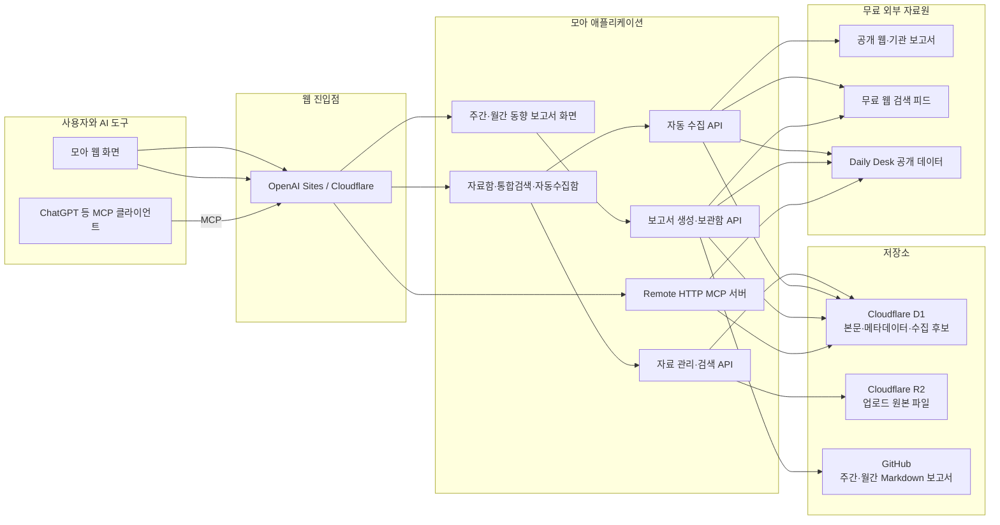

# 모아 구조 및 동작 설명

## 1. 모아란?

모아는 개인이 가진 파일·웹페이지·메모와 외부 동향 자료를 한곳에 축적하고, 검색과 보고서 작성에 활용하는 개인 지식 작업실입니다. 웹 화면에서는 자료를 저장·검색·삭제할 수 있고, 자동 수집함에서는 관심 분야의 후보 자료를 검토할 수 있습니다. ChatGPT 같은 외부 AI 도구는 MCP를 통해 모아와 Daily Desk 자료를 함께 검색할 수 있습니다.

모아의 자동수집·검색·기본 보고서 조립은 규칙 기반으로 동작하므로 별도의 유료 AI API가 필요하지 않습니다. 더 깊은 해석이나 문서 고도화가 필요할 때는 MCP로 연결한 ChatGPT를 활용할 수 있습니다.

## 2. 현재 주요 기능

- PDF, HWPX, DOCX, XLSX·XLS·XLSM·ODS, PPTX, TXT·MD·CSV 업로드와 텍스트 추출
- 웹페이지와 메모 저장, 자료 삭제, 제목·본문 통합 검색
- 자료함과 Daily Desk 동시 검색
- 자료함의 관심사를 반영한 AI·NPU·반도체 시장·기술·기업 동향 자동 탐색
- SPRI, IITP, KISDI, KIET, KISTEP, ETRI, KOTRA, OECD, WIPO, Stanford HAI 등 기관 보고서 탐색
- 관련도 70점 이상 후보 표시, 90점 이상 고신뢰 자료 자동 저장
- URL·유사 제목·본문 기준 중복 제거와 출처 차단
- 최근 7일·30일 자료를 종합한 주간·월간 이슈 중심 동향 보고서 작성
- GitHub의 `report/weekly`, `report/monthly` 보고서 목록과 Markdown 본문 표시
- 보고서 복사와 Markdown 다운로드
- MCP를 통한 모아·Daily Desk 통합 검색, 원문 조회, 최근 자료 조회

## 3. 전체 아키텍처

Mermaid 원본은 [`moa-architecture.mmd`](moa-architecture.mmd)에 별도로 보관합니다.

## 4. 화면과 API 구성

### 자료함과 통합 검색

`app/page.tsx`가 자료함, 파일 업로드, 웹페이지·메모 추가, 자동 수집함, 동향 보고서, 연결 안내 화면을 제공합니다. 자료함 메뉴를 누르면 필터와 검색어가 초기화된 전체 자료 화면으로 이동합니다. 통합 검색은 모아의 제목·본문뿐 아니라 Daily Desk도 함께 조회하며, 검색 결과에서 관련 내용과 출처를 확인할 수 있습니다.

| 형식 | 추출 방식 |
|---|---|
| PDF | PDF.js로 페이지 문자 추출 |
| DOCX | Mammoth로 본문 추출 |
| XLSX, XLS, XLSM, ODS | SheetJS로 시트 내용을 CSV 형태로 변환 |
| PPTX | 압축 내부 슬라이드 XML의 텍스트 추출 |
| HWPX | 압축 내부 XML의 텍스트 추출 |
| TXT, MD, CSV 등 | 일반 텍스트로 읽기 |

스캔 이미지로만 된 PDF에는 문자 데이터가 없으므로 OCR 없이는 본문을 추출할 수 없습니다.

주요 API는 다음과 같습니다.

- `/api/sources`: 자료 목록과 본문 검색
- `/api/source/:id`: 개별 자료 조회·삭제
- `/api/upload`: 원본 파일을 R2에 저장하고 추출 본문을 D1에 기록
- `/api/web-import`: 공개 웹페이지 본문 저장
- `/api/search`: 모아와 Daily Desk 통합 검색
- `/api/session`: 로그인·로그아웃

### 자동 수집함

- `/api/discovery/topics`: 사용자가 등록한 관심 주제 관리
- `/api/discovery/run`: 관심 프로필·등록 주제·기관별 보고서 검색 실행
- `/api/discovery/candidates`: 후보 조회, 자료함 저장, 제외, 출처 차단

최근 자료함 최대 100건에서 관심 용어를 추출하고 AI 반도체, NPU, AI 가속기, 데이터센터, HBM, 기업명 등을 중심으로 검색 계획을 만듭니다. Daily Desk와 무료 검색 피드를 함께 사용하며, 기관 검색은 기관별로 나누어 실행하고 실제 해당 기관 도메인의 결과만 받습니다.

후보 처리 흐름은 다음과 같습니다.

1. 관심 주제와 기관별 검색어로 후보를 수집합니다.
2. AI·반도체 맥락이 없는 사전·위키·쇼핑성 결과를 제외합니다.
3. 차단 도메인, 동일 URL, 유사 제목을 제거합니다.
4. 시장 수치, 기술 성능, 기업 사건, 보고서 여부를 이용해 관련도를 계산합니다.
5. 관련도 70점 이상만 자동 수집함에 표시합니다.
6. 90점 이상인 고신뢰 자료는 원문을 확인해 `AUTO_WEB` 자료로 자동 저장합니다.
7. 기관 보고서는 본문 추출이 제한돼도 제목·요약·원문 링크를 보존할 수 있습니다.

무료 운영을 위해 사이트가 닫힌 상태에서 상시 실행되는 백그라운드 수집기는 아닙니다. 모아 접속 시 하루 한 번 확인하고, `지금 새 자료 찾기`를 누르면 즉시 실행합니다.

### 주간·월간 동향 보고서

동향 보고서 화면에는 `주간`과 `월간` 탭이 있으며 두 종류의 보고서를 보여줍니다.

#### 즉시 작성 보고서

`/api/reports/trends`가 주간 7일, 월간 30일 범위의 다음 자료를 모읍니다.

- 모아 자료함에 자동 저장된 `AUTO_WEB` 자료
- Daily Desk의 최신 AI·NPU 동향
- 시장·기업·정책·기술별 무료 웹 조사 결과와 기관 보고서

수집한 자료는 URL과 제목 유사도를 기준으로 중복을 제거하고, 시장·기업·기술·정책으로 분류합니다. 같은 기업과 기술 또는 유사 제목을 공유하는 자료를 하나의 이슈로 묶어 기사 나열이 아닌 이슈 중심 보고서로 재구성합니다.

보고서는 다음 흐름으로 작성됩니다.

1. 전체 내용 요약과 작성일자
2. 분석 범위와 시장 구조
3. 주요 기업의 경쟁 구도
4. 기술 발전과 워크로드 전환
5. 정책·규제와 산업 기반
6. 종합 판단과 실행 전략
7. 시사점 및 향후 전망
8. 관련 근거와 실제 출처 링크

각 이슈에는 핵심 주장, 배경과 분석, 기업·기술 연결, 결론 및 시사점, 근거 출처가 포함됩니다. 보고서는 화면에서 읽거나 복사하고 Markdown 파일로 내려받을 수 있습니다. 이 생성 과정은 유료 생성형 AI 호출이 아니라 규칙 기반 초안 작성입니다.

#### GitHub 보고서 보관함

`/api/reports/archive`는 GitHub 저장소의 아래 폴더를 읽습니다.

- `report/weekly`: 주간 보고서 Markdown
- `report/monthly`: 월간 보고서 Markdown

파일명에서 날짜를 찾아 최신순으로 목록을 표시하고, 선택한 Markdown 보고서를 모아 화면 안에서 렌더링합니다. 따라서 ChatGPT 또는 다른 작성 도구가 완성한 보고서를 GitHub에 올리면 모아의 주간·월간 탭에서 바로 열람할 수 있습니다.

### MCP 서버

`/api/mcp`는 ChatGPT 같은 외부 도구가 모아를 자료원으로 사용할 수 있게 하는 Remote HTTP MCP 진입점입니다.

- `search`: 모아 자료함과 Daily Desk 동시 검색
- `fetch`: 검색 결과 ID로 원문과 출처 조회
- `list_recent_sources`: 최근 저장 자료 목록 조회

MCP 인증에는 화면 비밀번호가 아닌 별도의 MCP 토큰을 사용하며 비밀값은 GitHub 문서에 기록하지 않습니다.

## 5. 저장 구조

### Cloudflare D1

| 테이블 | 역할 |
|---|---|
| `sources` | 자료 제목, 유형, URL, 추출 본문, 파일 키, 처리 상태 |
| `discovery_topics` | 수동·자동 관심 주제와 마지막 실행 시각 |
| `discovery_candidates` | 발견 자료, 관련도, 출처, 처리 상태 |
| `blocked_hosts` | 자동 수집에서 제외할 도메인 |

### Cloudflare R2

업로드 원본 파일을 저장합니다. D1의 `sources.object_key`가 R2 파일을 가리키고, 검색용 추출 본문은 D1에 저장됩니다.

### GitHub

애플리케이션 소스와 구조 문서뿐 아니라 완성된 주간·월간 Markdown 보고서를 보관합니다. 모아는 GitHub API와 raw 파일 주소를 읽기 전용으로 사용해 보고서 목록과 본문을 표시합니다.

## 6. 주요 데이터 흐름

### 자료 저장과 검색

1. 파일, URL 또는 메모를 입력합니다.
2. 텍스트와 원본을 D1·R2에 저장합니다.
3. 화면 검색은 D1과 Daily Desk를 함께 조회합니다.
4. MCP 검색도 동일한 두 자료원을 AI에 제공합니다.

### 자동 수집에서 보고서까지

1. 자료함에서 관심 프로필을 만들고 사용자의 관심 주제를 합칩니다.
2. 무료 검색, 기관별 검색, Daily Desk에서 자료를 찾습니다.
3. 무관 결과와 중복을 제거하고 관련도를 계산합니다.
4. 70점 이상 후보를 표시하고 90점 이상은 자료함에 자동 저장합니다.
5. 주간·월간 보고서 작성 시 해당 기간의 모아·Daily Desk·웹 조사 자료를 취합합니다.
6. 동일 사건을 묶고 시장·기업·기술·정책 간 연결을 분석합니다.
7. 화면용 보고서와 다운로드 가능한 Markdown을 생성합니다.
8. 별도로 GitHub에 축적된 완성 보고서도 같은 화면에서 제공합니다.

## 7. 인증과 보안

- 웹 화면은 운영 환경의 접속 코드로 로그인합니다.
- 로그인 성공 시 세션 쿠키를 `HttpOnly`, `Secure`, `SameSite=Strict`로 저장합니다.
- 자료·수집·보고서 API는 로그인 세션을 확인합니다.
- MCP는 웹 로그인과 분리된 전용 토큰을 확인합니다.
- 접속 코드, 세션 비밀값, MCP 토큰은 GitHub에 저장하지 않고 운영 환경 비밀값으로 관리합니다.

현재는 한 사람이 쓰는 개인용 구조입니다. 다중 사용자 서비스로 확장하려면 계정, 사용자별 데이터 분리, 파일 소유권, 사용량 제한이 추가로 필요합니다.

## 8. 기술 및 배포 구조

- 애플리케이션: Next.js 16, React 19, vinext
- 실행 환경: OpenAI Sites 기반 Cloudflare Worker 호환 환경
- 데이터베이스: Cloudflare D1
- 파일 저장소: Cloudflare R2
- 데이터 접근: Drizzle ORM
- 보고서 보관: GitHub Markdown
- 외부 연동: Daily Desk, 무료 웹 검색 피드, Remote HTTP MCP

## 9. 현재 한계와 확장 지점

- 스캔 PDF와 이미지 OCR은 미지원
- 벡터 임베딩 기반 의미 검색은 미지원
- 사이트가 닫혀 있어도 실행되는 예약 수집은 미지원
- 즉시 작성 보고서는 규칙 기반 초안이므로 깊은 판단은 ChatGPT에서 고도화 필요
- 기관 사이트의 검색 노출 방식에 따라 일부 보고서를 찾지 못할 수 있음
- 다중 사용자 가입과 자료 분리는 미지원

OCR, 상시 예약 실행, 외부 AI 자동 집필을 추가할 수 있지만 선택한 서비스에 따라 비용이 발생할 수 있습니다.
