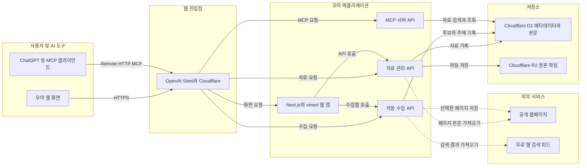

# 모아 구조 및 동작 설명

## 1. 모아란?

모아는 개인이 가진 자료를 저장하고 다시 찾기 쉽게 만드는 지식 저장소입니다. 사용자는 파일, 웹페이지, 메모를 모아에 넣고 제목과 본문으로 검색할 수 있습니다. ChatGPT 같은 외부 AI 도구는 MCP 인터페이스를 통해 모아의 자료를 검색하고 원문을 가져올 수 있습니다.

모아 자체가 답변을 생성하는 AI는 아닙니다. 자료를 보관하고 필요한 근거를 AI에 전달하는 역할을 담당하므로 현재 구조에서는 별도의 유료 AI API가 필요하지 않습니다.

## 2. 전체 아키텍처

다이어그램의 Mermaid 원본은 [`moa-architecture.mmd`](moa-architecture.mmd)에 별도로 보관합니다.

## 3. 구성요소별 역할

### 웹 화면

`app/page.tsx`가 자료함, 검색, 파일 업로드, 웹페이지·메모 추가, 자동 수집함, 연결 안내 화면을 제공합니다. 파일의 텍스트 추출은 가능한 경우 브라우저에서 먼저 수행됩니다.

| 형식 | 추출 방식 |
|---|---|
| PDF | PDF.js로 페이지 텍스트 추출 |
| DOCX | Mammoth로 본문 추출 |
| XLSX, XLS, XLSM, ODS | SheetJS로 시트 내용을 CSV 형태로 변환 |
| PPTX | 압축 내부의 슬라이드 XML에서 텍스트 추출 |
| HWPX | 압축 내부 XML에서 텍스트 추출 |
| TXT, MD, CSV 등 | 일반 텍스트로 읽기 |

스캔 이미지로만 구성된 PDF에는 문자 데이터가 없으므로 현재 방식만으로는 본문을 추출할 수 없습니다. 이런 파일은 OCR 기능이 별도로 필요합니다.

### 자료 관리 API

- `/api/sources`: 자료 목록과 본문 검색
- `/api/source/:id`: 개별 자료 조회 및 삭제
- `/api/upload`: 원본 파일을 R2에 저장하고 추출된 본문을 D1에 기록
- `/api/web-import`: 웹페이지 본문을 가져와 자료로 저장
- `/api/session`: 로그인과 로그아웃 처리

### 자동 수집 API

- `/api/discovery/topics`: 관심 주제 등록, 조회, 삭제
- `/api/discovery/run`: 관심 주제로 공개 웹 검색 수행
- `/api/discovery/candidates`: 후보 조회, 자료함 저장, 제외, 출처 차단

모아를 열면 서버가 마지막 실행 시각을 확인하여 주제별로 하루 한 번 검색합니다. 사용자가 `지금 새 자료 찾기`를 누르면 즉시 다시 검색합니다. 후보는 제목과 요약의 키워드를 이용한 규칙 기반 점수로 정렬하며, 자동 수집함에는 관련도 70점 이상만 표시합니다. 관련도 90점 이상이고 원문을 정상적으로 추출한 자료는 자료함에 자동 저장합니다.

검색 기준은 최근 자료함 최대 100개의 제목과 본문에서 AI 반도체, NPU, AI 가속기, 온디바이스 AI, 엣지 AI, HBM, 칩렛, CXL, 팹리스, 주요 기업 등 관심 용어의 빈도를 계산해 만듭니다. 이 관심 프로필과 기본 관심축인 시장 동향, 기술 개발, 기업·투자 동향, 정책·실증 동향을 결합해 검색어를 구성합니다. 유료 AI 모델이나 임베딩 API는 사용하지 않습니다.

이 기능은 사이트가 닫혀 있을 때 계속 실행되는 백그라운드 작업이 아닙니다. 무료 운영을 위해 사용자가 모아를 열었을 때 실행되는 구조입니다.

### MCP 서버

`/api/mcp`는 외부 AI 도구가 모아 자료를 읽을 수 있게 하는 Remote HTTP MCP 진입점입니다.

- `search`: 질문이나 키워드로 저장 자료 검색
- `fetch`: 검색 결과 ID로 자료 원문과 출처 조회
- `list_recent_sources`: 최근 저장 자료 목록 조회

MCP 인증에는 화면 로그인 비밀번호가 아니라 별도의 MCP 토큰을 사용합니다. 토큰은 소스 코드나 공개 문서에 기록하지 않습니다.

## 4. 저장 구조

### Cloudflare D1

| 테이블 | 역할 |
|---|---|
| `sources` | 자료 제목, 종류, URL, 추출 본문, 파일 키, 처리 상태 |
| `discovery_topics` | 자동 검색에 사용할 관심 주제와 마지막 실행 시각 |
| `discovery_candidates` | 발견한 웹 자료, 관련도, 처리 상태 |
| `blocked_hosts` | 자동 수집에서 제외할 웹사이트 도메인 |

### Cloudflare R2

업로드된 원본 파일을 저장합니다. D1의 `sources.object_key`가 R2 파일을 가리키며 검색에 사용하는 추출 본문은 D1에 저장됩니다.

## 5. 주요 데이터 흐름

### 파일 저장

1. 사용자가 웹 화면에서 파일을 선택합니다.
2. 브라우저가 지원 형식의 텍스트를 추출합니다.
3. `/api/upload`가 원본 파일을 R2에 저장합니다.
4. 제목, 파일 종류, R2 키, 추출 본문을 D1에 기록합니다.
5. 이후 화면 검색과 MCP 검색에서 본문을 사용할 수 있습니다.

### 웹페이지 저장

1. 사용자가 URL을 입력합니다.
2. `/api/web-import`가 공개 페이지를 요청합니다.
3. 스크립트와 스타일을 제외하고 읽을 수 있는 텍스트를 추출합니다.
4. URL, 제목, 본문을 D1의 `sources`에 저장합니다.

### 자동 수집

1. 사용자가 관심 주제를 등록합니다.
2. 모아 접속 시 하루 한 번 또는 사용자의 즉시 검색 요청 시 무료 웹 검색 피드를 조회합니다.
3. 중복 URL과 차단한 도메인을 제외합니다.
4. 규칙 기반 관련도와 후보 정보를 D1에 저장합니다.
5. 관련도 70점 이상 후보만 화면에 표시합니다.
6. 관련도 90점 이상이며 원문이 200자 이상 추출된 후보는 자동 저장합니다.
7. 나머지 후보는 사용자가 검토한 뒤 정식 자료함의 `sources`로 저장할 수 있습니다.

### AI에서 자료 사용

1. MCP 클라이언트가 전용 토큰과 함께 `/api/mcp`에 연결합니다.
2. AI가 `search`로 관련 자료를 찾습니다.
3. 필요한 자료는 `fetch`로 원문과 출처를 확인합니다.
4. AI는 해당 자료를 근거로 답변, 기획서 또는 보고서 초안을 작성합니다.

## 6. 인증과 보안

- 웹 화면은 운영 환경의 접속 코드로 로그인합니다.
- 로그인 성공 시 SHA-256 기반 세션 값이 `HttpOnly`, `Secure`, `SameSite=Strict` 쿠키에 저장됩니다.
- 자료 API는 로그인 세션을 확인합니다.
- MCP는 웹 로그인과 분리된 전용 토큰을 확인합니다.
- 접속 코드, 세션 비밀값, MCP 토큰은 GitHub에 저장하지 않고 운영 환경의 비밀값으로 관리합니다.

현재 모아는 한 사람이 사용하는 개인용 구조입니다. 여러 사용자가 각자 가입해서 독립적인 자료함을 쓰게 하려면 사용자 계정, 사용자별 데이터 구분, 파일 소유권과 권한 관리 기능을 추가해야 합니다.

## 7. 기술 및 배포 구조

- 애플리케이션: Next.js 16, React 19, vinext
- 실행 환경: OpenAI Sites 기반 Cloudflare Worker 호환 환경
- 데이터베이스: Cloudflare D1
- 파일 저장소: Cloudflare R2
- 데이터 접근: Drizzle ORM
- 마이그레이션: `drizzle/` 폴더의 SQL 파일

`.openai/hosting.json`에는 운영 사이트 프로젝트와 논리적인 D1·R2 바인딩만 기록합니다. 실제 비밀 환경변수는 배포 환경에서 별도로 관리합니다.

## 8. 현재 범위와 확장 지점

현재 구현되지 않은 대표 기능은 다음과 같습니다.

- 스캔 PDF와 이미지의 OCR
- 벡터 임베딩 기반 의미 검색
- 사이트가 닫혀 있어도 실행되는 예약 수집
- 사용자별 가입과 자료 분리
- AI가 자동으로 작성하는 문서 작업실

이 기능들은 추가할 수 있지만 OCR, 의미 검색, 상시 예약 실행, AI 생성은 선택한 서비스에 따라 비용이 발생할 수 있습니다.
